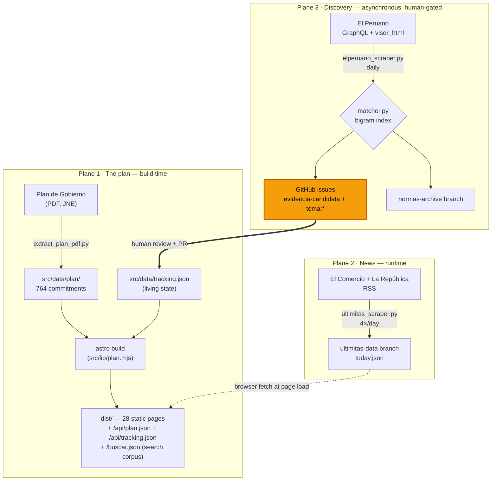

# Architecture

`keikogobierna` tracks the 2026–2031 government plan against what the government actually does. The site is an Astro static build (`output: "static"`, no client framework, Tailwind v4 via the Vite plugin): 28 HTML pages + 3 JSON endpoints, ~2.0 MB, built ahead of time from JSON in `src/data/`.

Everything else in the repo exists to answer one question — *did they do it?* — and to keep a human in the loop when answering it.

## Big picture

Three planes move data, and they run on completely different clocks.



The amber node is the only step a machine does not perform.

**Plane 1 — the plan (build time, immutable).** The PDF was extracted once into `src/data/plan/`; `tracking.json` holds the living status. `astro build` reads both through `src/lib/plan.mjs` and emits plain HTML. Every commitment page is fully rendered before a visitor arrives.

**Plane 2 — the news (runtime, live).** `/ultimitas/` is the one page that fetches at load: its client script pulls `today.json` from the `ultimitas-data` branch over raw.githubusercontent.com. Fresh headlines four times a day without rebuilding or redeploying the site.

**Plane 3 — discovery (asynchronous, human-gated).** Scrapers read primary sources, match them against the plan's own commitments, and file GitHub issues. **Nothing automated ever writes `tracking.json`** — a status changes only when a human reviews an issue and opens a PR. That PR triggers a rebuild, closing the loop back to plane 1.

**Two invariants hold the design together:**
- **No AI in any pipeline.** Matching is deterministic (phrase index, no model calls); judging a candidate is a human job by design. Running cost is $0 — public-repo Actions, free unofficial APIs, git as the datastore.
- **Discovery ≠ certification.** Tools only ever suggest.

## Commands

| Command | Effect |
|---|---|
| `npm install` | Install dependencies |
| `npm run dev` | Dev server with HMR at http://localhost:3000 |
| `npm run build` | Static build to `dist/` |
| `npm run preview` | Serve the `dist/` build locally |
| `npm test` | `node --test tests/**/*.test.mjs` (data-layer unit tests) |
| `npm run validate` | `python3 tools/plan/validate_plan_data.py` (plan tree + tracking integrity) |
| `python3 -m unittest discover -s tools/tests -p "test_*.py"` | Scraper/matcher unit tests |
| `python3 tools/scrapers/<name>.py --dry-run` | Run any scraper locally with no writes and no GitHub calls |

## The site

| Path | Responsibility |
|---|---|
| `astro.config.mjs` | Static output, dev/preview port 3000, `@tailwindcss/vite` plugin |
| `src/lib/plan.mjs` | Build-time data access + aggregates (pure functions; JSON via static ESM imports — `fs` reads break under the bundler, see the comment in the file): `loadPlan`, `loadTopics`, `loadGoals`, `loadTracking`, `statusOf`, `goalStats`, `topicSummaries`, `updatesLog`, `firstHundredDays`, `firstHundredDaysStats`, `fulfilledItems` |
| `src/lib/statuses.mjs` | `STATUSES` map (fulfilled/in_progress/no_progress/unfulfilled → Spanish label + color) and `statusMeta()` |
| `src/lib/format.mjs` | `formatDateEs()` — shared by build-time components and the Ultimitas client script |
| `src/lib/search.mjs` | The buscador: `foldText`, `foldWithMap`, `buildCorpus`, `prepare`, `searchCorpus`. Pure, and **imports no JSON** — it ships to the browser, so a static data import would drag the whole plan into the client bundle |
| `src/layouts/Base.astro` | `<head>` (title/description/OG, lang `es-PE`, fonts, `global.css`), header nav, footer, donate widget, reveal script |
| `src/styles/global.css` | Tailwind v4 `@theme` tokens + custom CSS (grain, stamps, pen, reveal, buttons) |

**Pages** — `index.astro` (landing: hero, tracker card, 23-topic grid, cumplidas registry), `temas/[slug].astro` (23 topic pages via `getStaticPaths()`), `primeros-100-dias.astro` (all 67 actions by pillar → topic, with a launch-window tally), `ultimitas.astro` (live news), `fuentes.astro`, `privacidad.astro`, and `api/plan.json.ts` + `api/tracking.json.ts` (datos-abiertos endpoints rendered once at build into `dist/api/`, stamped with the `package.json` version). `buscar.json.ts` renders the search corpus to `dist/buscar.json` — 764 records, 54 KB gzipped, fetched by the overlay on first open. It sits at the root rather than under `/api/` on purpose: that path is the public datos-abiertos contract, and search must never drive changes to it.

**Components** — flat `.astro` files for Tailwind-only pieces (`Stamp`, `PenProgress`, `TrackerCard`, `TopicCard`, `GoalRow`, `ProposalRow`, `HeroBanner`, `CumplidasRegistry`); folder modules for anything carrying its own CSS/JS (`Donate/`, `IndexRail/`, `Search/`, `Ultimitas/`). That split is the convention: a component that needs a stylesheet or a client script gets a folder.

`Ultimitas/ultimitas.ts` is the only component that talks to the network. It renders every field through `textContent`, never `innerHTML` — the feed is third-party text.

## Plan data

Immutable (derived from the PDF) except for tracking state, which is living. The separation is what makes the data restorable while progress stays editable.

```
src/data/plan/
├── index.json                        # Registry: 3 pillars, 23 topics, 632 proposals, 67 first-100-days actions, 65 goals
├── topics/
│   └── t1-1-orden-ciudadano.json     # ×23 (file names use Spanish slugs)
└── goals/
    └── goals-2031.json               # Hand-curated
src/data/tracking.json                # Living state: goal status + progress log
```

**ID scheme** (frozen once assigned — `tracking.json` references these, so renumbering is not permitted):
- Topics `t{pillar}-{n}` (`t1-1`) · Proposals `{topic}.P{nn}` (`t1-1.P07`) · First-100-days `{topic}.C{nn}` (`t1-1.C01`) · Goals `{topic}.M{nn}` (`t1-1.M01`)

A topic id is recoverable from any commitment id by cutting at the `.` — the matcher relies on this to label issues by tema without storing a mapping.

**Two-layer tracking rule (critical):** all 632 proposals are listed and trackable, but **the headline progress % is computed ONLY from goals** (metas al 2031). `tracking.json` stores status + evidence for goals; proposals are seeded absent and appear only when a status first changes.

**Naming rule:** JSON keys and identifiers in English (`proposals`, `status`, `in_progress`); all user-facing content (plan names, proposal text, Spanish slugs) exactly as the PDF states.

**Editing:**
- **Proposals + first-100-days:** never hand-edit — auto-extracted by `tools/plan/extract_plan_pdf.py` (deterministic, never overwrites goals); corrections go in `src/data/plan/overrides.json` and are applied post-extraction.
- **Goals:** hand-curated in `goals-2031.json` (the PDF tables are not machine-parseable, so goals are never regenerated).
- **Tracking:** edit freely — log date/status/evidence.
- **After any edit under `src/data/`:** run `npm run validate`.

## Discovery pipeline

Python, stdlib only (`pypdf` is the single exception — an El Peruano PDF fallback). `tools/scrapers/watcher_common.py` holds what every source shares: HTTP, RSS parsing, tokenization, GitHub issue/label plumbing, and `dedup_token()`.

| Tool | Source | Cadence | Output |
|---|---|---|---|
| `elperuano_scraper.py` | El Peruano GraphQL (`/api/graphql`) + `/api/visor_html/<op>` for full norma text | daily 13:00 UTC (~08:00 Lima) | Issues + `normas-archive` branch |
| `ultimitas_scraper.py` | El Comercio Arc XP RSS + La República RSS | 4×/day (Lima 00/06/12/18) | `ultimitas-data` branch |

Both news sources are read for metadata only — headline, link, snippet, author, date. Article bodies (`content:encoded`, copyrighted norma text beyond an excerpt) are never stored or rendered.

The El Peruano interface is **unofficial**. If it changes shape, the run fails loudly and we fix the tool — that's the accepted trade for $0 access to the primary record. The daily-PDF parser survives as a documented fallback.

### The matcher

The interesting problem: ~600 normas land per day, and 764 commitments to check them against. `build_commitment_index.py` builds `commitment_index.json` — for each commitment, the **bigrams** distinctive to it (document frequency ≤ `DF_MAX_BIGRAM`, currently 12, measured across the plan). `matcher.py` tokenizes a norma the same way and matches on shared phrases.

Bigrams **only**, deliberately. A word rare in the plan is still common in daily normas ("fiscal", "horario"), and unigram matching flooded the queue with 136–247 hits/day. Bigrams cut that to 8–26; a curated `suppress_phrases` stoplist in `commitment_overlay.json` (generic government bigrams like "poder judicial" — plan-rare but norma-ubiquitous) brings it to **5–13/day**. The overlay is the tuning surface: `boost` (hand-curated phrases, the only route by which a single word can match), `suppress_terms`, `suppress_phrases`, `mute_commitments`.

The index is generated but **committed**, so matching changes are reviewable in a PR; CI runs `--check` to catch drift from the plan.

Known limit: distinctiveness is measured only against the plan, never against the norma stream, which is why generic bigrams need a hand-maintained stoplist. The principled fix — a document-frequency corpus built from real normas — waits on `normas-archive` accumulating enough history.

### Data branches

`ultimitas-data` and `normas-archive` are **orphan branches carrying only JSON** — never merged into `main`, never built. `tools/ci/publish_data_branch.sh` publishes to them from a throwaway `git worktree`, committing only when content actually changed and never touching the current checkout's config.

Why branches: the site stays static and the data updates without a rebuild, at zero storage cost. The `protect-main` ruleset covers only the default branch, so an Action can push here freely. raw.githubusercontent.com is CORS-open on public repos, so the browser can read it directly.

The data branches are host-independent — they are just git, and the browser reads them from raw.githubusercontent.com no matter where the site is hosted. Vercel never builds them because `vercel.json` disables them explicitly (`git.deploymentEnabled: false` for both), keeping the scrapers' 4×/day pushes invisible to the Git integration that deploys everything else.

## CI and releases

`ci.yml` runs on every PR as the `checks` job: `npm ci` → `npm test` → `npm run validate` → `build_commitment_index.py --check` → `unittest discover -s tools/tests` → `npm run build`.

`main` is protected by the `protect-main` ruleset: PRs required, `checks` must pass, linear history, no force pushes. Merges are always **rebase-and-merge**. release-please maintains a release PR from conventional commits (`feat:` → minor, `fix:` → patch, `feat!:` → major); merging it tags `vX.Y.Z` and updates `CHANGELOG.md`. Release PRs never trigger CI (Actions-token authored), so they need admin bypass to merge — the one sanctioned use of it.

Vercel's **Git integration** deploys the site: every push to `main` becomes a production deploy at https://www.keikogobierna.com, and every PR gets a preview deployment. There is no deploy workflow in the repo and no Vercel secrets — the integration watches GitHub directly, and `vercel.json` excludes the data branches from it. A failed build leaves the previous production deployment live. See [workflows/deploy.md](../workflows/deploy.md).

## Rules

- New page sections = a new component in `src/components/`, composed into a page or `Base.astro`. Components with their own CSS/JS get a folder module.
- All tracker content changes happen in `src/data/`, never in component markup.
- Run `npm run validate` after every data edit under `src/data/`.
- Status colors/labels live in `src/lib/statuses.mjs` (`STATUSES`); add new statuses there and in `tools/plan/validate_plan_data.py` (`VALID_STATUSES`) together.
- Search results deep-link to `/temas/<slug>/#<id>`; every commitment row carries its `id` and `class="commitment"`. Removing either breaks search silently — nothing errors, the link just lands at the top of the page.
- Regenerate `commitment_index.json` after any plan change (CI enforces it).
- Scrapers never write `tracking.json`. Discovery files issues; humans certify via PR.
