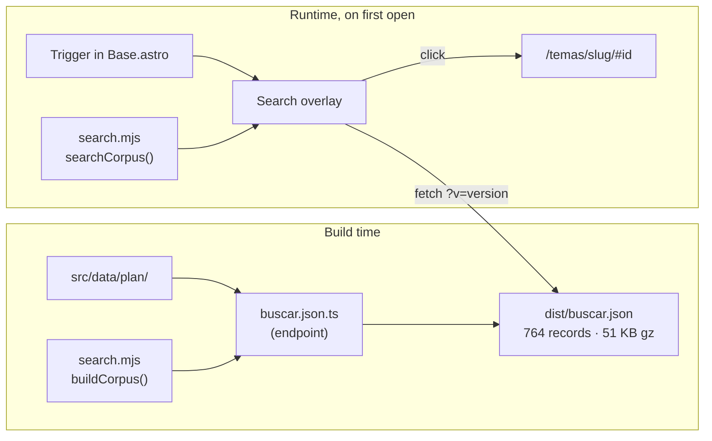

# Buscador — design

**Date:** 2026-07-28
**Branch:** `feat/site-search`
**Status:** approved

## Problem

The plan holds 764 commitments spread across 23 topic pages. A visitor who wants
to know what the plan says about *Beca 18* has no way to ask. They must guess
which tema owns the subject, open it, and read.

Guessing fails. The word "beca" appears in **19 commitments across 6 topics** —
16 propuestas, 2 acciones de los primeros 100 días and 1 meta al 2031:

| Tema | Hits | Example |
|---|---|---|
| Niños, adolescentes y jóvenes | 8 | «Beca Retoma tus Estudios» |
| Educación | 4 | Duplicar el acceso a becas (meta al 2031) |
| Deporte | 3 | Beca Deporte Escolar, Beca 18 |
| Orden ciudadano | 2 | becas en prevención temprana del delito |
| Orden jurídico | 1 | Carrera Nacional de Defensa de Oficio |
| Peruanos en el extranjero | 1 | becas técnicas virtuales |

Nobody looks for scholarships under *Orden ciudadano*. The information is
public, published and already on the site — and effectively unreachable.

## Goal

One searcher, reachable from every page, that filters all 764 commitments and
shows **which part of the plan each hit belongs to**.

## Decisions

Settled during brainstorming; recorded here because each closes off alternatives.

| Decision | Choice | Why |
|---|---|---|
| Scope | Plan commitments only — 632 propuestas, 67 acciones de 100 días, 65 metas | One clean corpus. Últimitas changes 4×/day from a data branch and the gabinete lives on an unmerged branch; coupling to either would tie this feature to their release. |
| Entry point | Overlay from every page | A visitor already reading a tema must not lose their place. Below `md` the header nav is `hidden md:flex`, so this is also the first navigation mobile visitors get. |
| Results | Grouped by tema | Directly answers "where does this belong". A flat list would hide that becas span six topics. |
| Multi-word | All terms, then widen | Precise when it can be, never a dead end. |
| Index transport | Purpose-built `/buscar.json`, lazy-fetched | 51 KB gzipped, fetched only when the overlay first opens. |

## Architecture

Three units with clean seams.



`search.mjs` is the same file in both columns. There is one matching
implementation, exercised by `node --test` and shipped to the browser.

### 1. The corpus

A new endpoint `src/pages/buscar.json.ts` renders once at build into
`dist/buscar.json`:

```json
{
  "version": "2.4.0",
  "items": [
    {"i": "t3-2.P38", "k": "p", "t": "educacion", "g": "Educación Superior Universitaria",
     "x": "Ampliación del Programa Nacional de Becas (PRONABEC)…"}
  ]
}
```

Keys are short because the field names repeat 764 times. `k` is `p` (propuesta),
`c` (100 días) or `m` (meta). `g` (group title) is present only on propuestas.
For metas, `x` concatenates the goal text and its indicator so both are
searchable; the indicator is not displayed.

**Not under `/api/`.** That path is the documented datos-abiertos contract with
CORS and `s-maxage` headers set in `vercel.json`. Search is an internal artifact,
and its needs must never drive changes to a public API.

**Cache busting:** fetched as `/buscar.json?v={pkg.version}`. Plan data changes
rarely, and every change ships with a release.

**Considered and rejected:** reusing `/api/plan.json`. Same wire size (52 KB gz
vs 51), but nested by topic → group → proposal and carrying evidence and
indicators the searcher never reads. A flat file keeps the client script simple.

### 2. `src/lib/search.mjs`

Pure functions. **Imports no JSON.** All data arrives as arguments — the same
injection style `cabinet.mjs` uses for `dataset(data)`. This is load-bearing: a
static import of the plan files here would bundle 200 KB of plan data into the
client script.

```js
/** Build time only. */
export function buildCorpus(plan, topics, goals)   // → { version, items }

/** Both. NFKD, strip combining marks, lowercase. */
export function foldText(s)                        // "Educación" → "educacion"

/** Browser and tests. */
export function searchCorpus(corpus, query)
// → {
//   mode:  'idle' | 'strict' | 'widened',
//   total: number,               // items across all groups
//   terms: string[],             // folded query terms actually used
//   groups: [{
//     slug:  string,             // topic slug, for the /temas/<slug>/ link
//     name:  string,             // topic name, the group heading
//     count: number,             // hits in this topic (may exceed items.length)
//     items: [{
//       item:   CorpusItem,      // the record as stored: i, k, t, g, x
//       ranges: [number, number][]  // [start, end) offsets into item.x to mark
//     }]
//   }]
// }
```

`prepare(items)` folds every item's text once on load and caches it on the
record; queries then scan the folded copy. Measured at **0.018 ms per query**
over the full corpus, so no inverted index is built — it would be ceremony.

**Offsets must survive folding.** Matches are found in the folded text but
`ranges` index the original, and folding is not length-preserving in general
(NFKD turns `fi` into `fi`). So `prepare` folds **character by character** and
keeps a map from each folded offset back to its source offset. Highlighting a
match then never drifts, whatever the input contains. A test pins this with an
accented term.

### 3. `src/components/Search/`

A folder module, per the convention that any component with its own CSS or JS
gets one.

| File | Responsibility |
|---|---|
| `Search.astro` | Trigger button + overlay markup. Rendered once in `Base.astro`. |
| `search.ts` | Open/close, focus trap, lazy fetch + in-memory cache, 120 ms debounce, render, keyboard nav |
| `search.css` | Overlay surface, backdrop, result rows, `:target` arrival highlight |

## Matching

Fold accents and case on both sides, split the query on whitespace, drop terms
shorter than 2 characters, then require **every** term as a substring of the
folded text.

Substring rather than word-prefix on purpose: `beca` must find *becas* and
*PRONABEC*, and Spanish inflection makes prefix matching asymmetric
(`becas` would not find `beca`).

**Widening.** If the strict pass returns zero and there are 2+ terms, rerun
keeping items that match the largest achievable number of terms, and set
`mode: 'widened'`. The UI then reads:

> Ningún resultado con todas las palabras. Coincidencias parciales:

**Ranking.**
- Topics: by hit count descending, then plan order (pillar, then topic number).
- Within a topic: by terms matched descending, then earliest match position, then id.
- First 3 items shown per topic, with «… N más en este tema» revealing the rest.

**Minimum query:** 2 characters. Below that the overlay shows its idle state
(`mode: 'idle'`), not an empty-results message.

**No** fuzzy matching, stemming library, or synonyms. Deterministic and
explainable, consistent with the no-AI-in-pipelines invariant.

## Deep links

Sections carry anchors today (`#metas`, `#propuestas`, `#cien-dias`,
`#grupo-N`); individual commitments do not. Three components change:

- `ProposalRow.astro` — `id={id}` on the `<li>`
- `GoalRow.astro` — starts accepting `id`, sets it on the row
- The 100-días list in `temas/[slug].astro` — `id` on each row

Every result links to its tema: `/temas/educacion/#t3-2.P38`. **Including
100-días actions**, which also render on `/primeros-100-dias/`. One destination
rule — where a commitment belongs is its topic — and it matches the grouping the
results already show.

Arrival highlight uses CSS `:target`. That avoids escaping the `.` in
`#t3-2.P38`, which a class or id selector would require (`#t3-2\.P38`).
`scroll-mt` keeps the row clear of the header.

**Known and correct:** the plan itself repeats some commitments across topics —
`t3-1.P42` and `t3-9.P04` are the same sentence. Both appear in results. They
are two commitments the plan made in two places, and grouping makes that visible
rather than hiding it.

## Failure, access, no-JS

- **Fetch fails** → Spanish error inside the overlay with a retry button. The
  page never breaks; search is additive.
- **XSS** → results are built with `textContent` and `<mark>` DOM nodes, never
  `innerHTML`. Same rule `Ultimitas/ultimitas.ts` follows. The content is our own
  plan data, but the highlighter is the kind of code that later gets pointed at
  untrusted text.
- **Accessibility** → `role="dialog"` + `aria-modal="true"` + labelled by the
  heading; Escape closes; focus moves into the input on open and returns to the
  trigger on close; focus trapped while open; `↑`/`↓` move through results and
  Enter follows one; the result count is announced via `aria-live="polite"`;
  `prefers-reduced-motion` respected.
- **No JS** → the trigger renders hidden and the script reveals it. There is no
  `/buscar` page to degrade to; that follows from choosing overlay-only.
- **Body scroll** is locked while the overlay is open and restored on close.

## Testing

`tests/search.test.mjs`, run by `npm test`, against the **real committed plan
data** rather than hand-made fixtures.

| Case | Expectation |
|---|---|
| `beca` | 19 items across 6 topics; Orden ciudadano among them |
| `beca 18` | 2 items, `mode: 'strict'` |
| `beca dental` | non-empty, `mode: 'widened'` |
| `educación` vs `educacion` | identical results |
| `""`, `"a"` | `mode: 'idle'`, no results |
| Ranking | topic with most hits first; ≤3 items per group with an accurate overflow count |
| `buildCorpus` | 764 items; every `t` resolves to a real topic slug; every `i` is unique |

The last row is the guard that matters: a corpus entry pointing at a topic that
does not exist would produce a dead link from search into a 404.

## Out of scope

Typo tolerance, synonyms, search history and suggestions, a dedicated `/buscar`
page, searching Últimitas or the gabinete, and any analytics on what people
search for.
